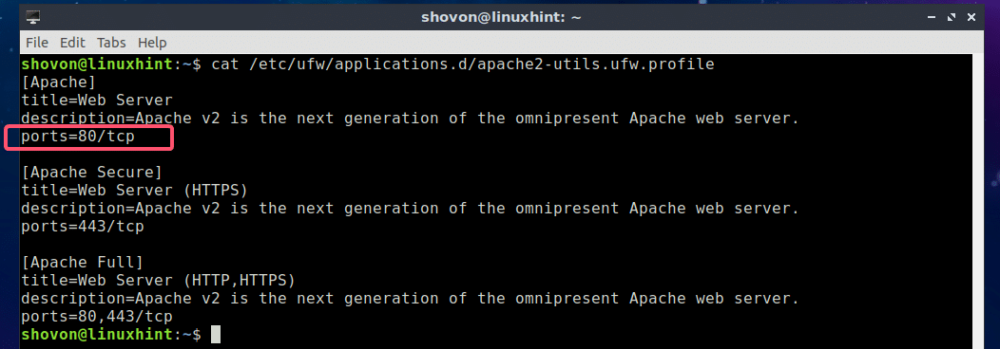
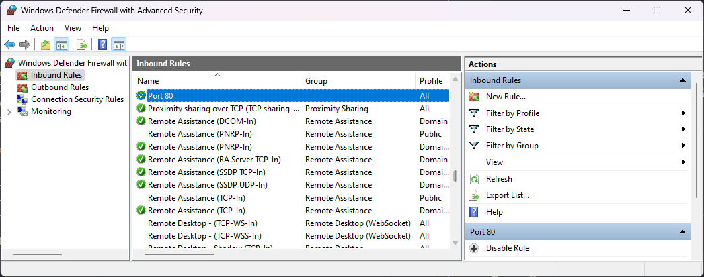

# Deploying Laravel App on a Subdirectory via Apache Web Server


This guide walks you through **deploying your Laravel application within a subdirectory on your Apache web server**. By following these steps, you'll achieve a clean URL structure and have your application accessible through a user-friendly address.

## Requirements
Download and install necessary software to run your web server. Refer to their documentations.

 - [Apache](https://httpd.apache.org/download.cgi)
 - [PHP](https://www.php.net/downloads)
 - [Laravel](https://laravel.com/)


## Apache Configuration
Define your apache virtual host configuration. Below is a sample
```apache
<VirtualHost *:80>
  # Server name will serve as the entry url in the browser.
  # It can be named domain of yours. IP Address would also work.
  # Define as you need.
  ServerName yourdomain.com

  # Document root will be initially rendered upon hitting your server name.
  # You can leverage the directory where your laravel apps are located.
  DocumentRoot "/www/laravel-apps/"

  # Alias defines what should be rendered when hitting a specific route.
  # Start with the alias name followed by what directory will be rendered.
  # To render a laravel app, hit the public directory of your laravel codebase.
  Alias /app-1 "www/laravel-apps/laravel-app-1/public"

  # Define the options for the directory being hit, particulary for the Laravel projects.
  <Directory "www/laravel-apps/brow-trends-connect/public/">
      # This is the current default options.
      # Change as you need. Be sure to test first
      Options +Indexes +Includes +FollowSymLinks +MultiViews
      AllowOverride All

      # The require option handles what/who are allowed to access your app.
      # Local means the current machine. You may add, and deny ip address as well.
      Require local
  </Directory>
 </VirtualHost>
```
Save your configuration afterwards then restart the Apache Web Server.


## Laravel Configuration

### .htaccess
Go to your laravel app directory which was used in the virtual host configuration. Create a .htaccess file with the following code:
```apache
<IfModule mod_rewrite.c>

# Direct all requests to /public folder

RewriteEngine On
RewriteCond  %{REQUEST_URI}  !/public
RewriteRule  ^(.*)$ public/$1 [L]

</IfModule>
```
Save if afterwards.

### routing
Modify the routes of your laravel app (api and web depending on what you had used) to hit the corrent url on your browser. Enclosed all the route definitions with a prefix same with Alias definition you had made a while ago in the virtual hosts. Below is a sample for the Alias /app-1

```php
Route::prefix('/app-1')->group(function () {

	Route::get('/', function() {
		return  view('welcome');
	});
});
```
This will ensure that all the route definition will match and hit with the virtual host configuration. Do not forget to clear and cache your routes for optimization.

```bash
php artisan route:clear
php artisan route:cache
```


### vite
Modern laravel apps uses vite as asset bundling tool. Before building to production, define in the .env file of your laravel an ASSET_URL pointing to the defined alias of your app. Below is a sample.

```env
APP_NAME=laravel
APP_ENV=production
APP_KEY='some app key'
APP_DEBUG=false
APP_URL=http://yourdomain.com/app-1
ASSET_URL='/app-1/'
```

# Firewall
Port 80 is used as the default port. For local network access, grant permission from the server to allow all incoming connections through the port. This can be done via the server's firewall. Refer to the sample below. 
(Image reference to [linuxhunt](https://external-content.duckduckgo.com/iu/?u=https%3A%2F%2Flinuxhint.com%2Fwp-content%2Fuploads%2F2018%2F11%2F14-8.png&f=1&nofb=1&ipt=d79a9e5634d14b8171f570713e3242ba359bf13e8889c0d30579020c74219e5f&ipo=images))






